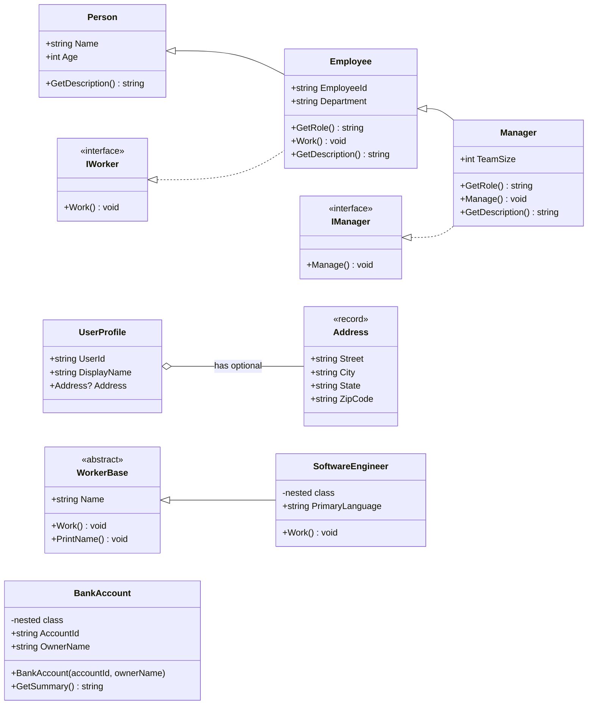

# 03 - OOP

This project focuses on C# object-oriented programming concepts, especially the differences between Java OOP and modern C# OOP.

## Topics

- class
- constructor
- property
- inheritance
- interface
- abstract class
- virtual / override
- sealed
- record
- init-only property

## UML Class Diagram



## Run

```bash
dotnet run
```

## Key Java vs C# Differences

| Java | C# |
|---|---|
| Getter / Setter | Property |
| `extends` | `:` |
| `implements` | `:` |
| `final` class | `sealed` class |
| Java record | C# record |
| Override by default? | Must explicitly use `virtual` |
| `@Override` | `override` |
| Immutable init pattern | `init` |


## Key Takeaways:
* Properties replace much of the boilerplate getter/setter code common in Java.
* Interfaces convertially start with `I` in .NET.
* `virtual` and `override` must be explicitly declared.
* `sealed` is the C# equivalant of Java's `final` class.
* Records provide concise immutable data models with build-in value equality.
* `init` enables immutable object initialization patterns.
