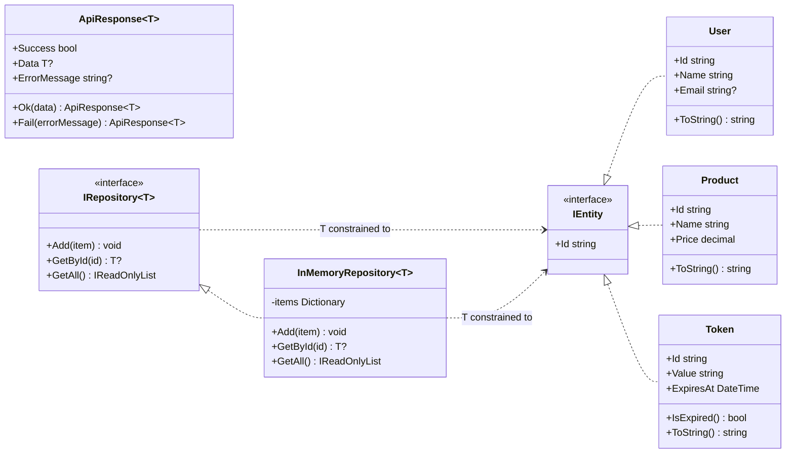

# 04 - Generics

This project focuses on C# generics and compares them with Java generics.

## Topics

- Generic methods
- Generic classes
- Generic interfaces
- Generic repositories
- Type constraints
- `where T : class`
- `where T : new()`
- `where T : IEntity`
- `default`
- Type-safe reusable code

## UML Class Diagram



Notes:

- `ApiResponse<T>` is an unconstrained generic wrapper, so it can wrap any type.
- `IRepository<T>` and `InMemoryRepository<T>` both require `where T : IEntity`.

## Run

```bash
dotnet run
```

## Key Java vs C# Differences

| Java | C# |
|---|---|
| `List<T>` | `List<T>` |
| `Map<K,V>` | `Dictionary<TKey,TValue>` |
| `T extends SomeClass` | `where T : SomeClass` |
| `T extends Interface` | `where T : IInterface` |
| `new T()` not directly allowed | `where T : new()` enables `new T()` |
| Type erasure | Reified generics at runtime |
